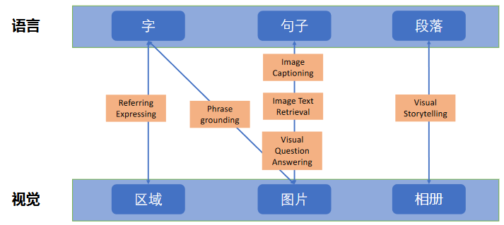
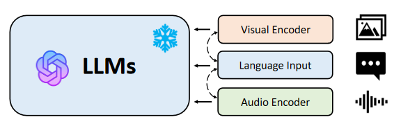

[TOC]

# 讲习班信息

1. 时间：2023年12月2日-12月3日
2. 地点：四川省成都市四川大学望江校区
3. 主题：
- 主题1：基础大模型构建
- 主题2：检索增强的大模型
- 主题3：大模型安全与对齐
- 主题4：领域大模型构建
- 主题5：大模型智能体与工具学习
- 主题6：跨模态大模型

# 从模型预训练到面向应用的技术研究
报告人：李俊涛 副教授，单位：苏州大学，联系方式：ljt@suda.edu.cn

## 基座模型预训练

**训练流程** 
1. 数据：数据方案，数据准备，成品数据集
2. 模型结构设计：Decoder-only，Enc-Dec，增强策略
3. 训练框架与加速：GPU型号，训练框架，加速框架
4. 评测：Reference-based，Preference-based，Agent-based，安全

**数据预处理**
1. 质量过滤：语言过滤，指标过滤，统计特征过滤，关键词过滤
2. 冗余去除：句子级别，文档级别，数据集级别
3. 隐私消除：隐私数据发现，隐私数据消除
4. 词元切分：子词词元化，字节对编码，WordPiece

**模型结构设计**
1. Encoder-only模型：可行，大模型较少，非自回归解码策略
2. Encoder-Decoder模型：很强，工程难度，无法实时监测模型能力
3. Decoder-only模型：很强，社区更大，工程优化更好，实时测试模型能力，训练难度相对较低

**增强策略**
1. 训练稳定性与训练效率：
- SwiGLUT激活函数（效果好，速度快，参考PaLM和LLaMA）
- Sandwich Layer Normalization（训练稳定性）
2. 长度外推：Rotary位置编码（生成长度的可扩展性）
3. Checkpoint Activation：Memory usage
4. Distributed Optimizer：更少的GPU memory，便于继续开大 batchsize
5. KV-Cache：减少重复计算量，提高推理效率

**并行加速**
1. 数据并行：基于PyTorch-DDP
2. 模型并行：基于Megatron TP，forward 和 backward多了通信的过程，张量并行
3. 流水线并行：基于Megatron PP

**LLM评测**
1. Reference-based：CMMLU，C-EVAL，MMLU
2. Preference-based：ChatBot Arena，FollowBench
3. Agent-based：ChatEval，GameEval
4. others：Safety Assessment，Red Teaming，API-Bank

**总结**
1. 数据：可被学习的Pattern，数据、质量、分布多样性
2. 模型：记忆/组合/泛化Pattern，容量、合适的结构
3. 目标函数：学习不同Pattern的效率，因场景而定

# 大模型对齐
报告人：崔淦渠，单位：ZTHUNLP，联系方式：
## 监督学习（SFT）
1. 基础模型微调：
- 使用特定任务标注数据对预训练模型进行**全参数微调**
- 需要提前定义任务形式和标注数据，多任务间泛化能力差
2. 大模型微调:
- 大模型在微调中更新所有参数，需要在**计算**中占用庞大的显存
- 大模型在微调中对每一个任务存储一个大模型，需要占用庞大的**存储**空间
- 模型的参数规模越来越大，使之更加难以微调；任务种类繁多，难以对所有任务进行全参数微调
- 适用大模型的微调方案：**多任务指令微调**

### 微调技术发展脉络：泛化和高效
<!-- BERT & GPT，对特定任务进行全量微调 -->

**泛化**：在更多任务/更少数据的条件下提升泛化表现
- Prompting [Brown etal. 2021]：通过提示驱动少样本学习
- Prompt Learning [Schick et al.,; Gao et al.; Han tet al. 2021]：将下游任务转化为预训练任务
- Instruction Tuning [Wel et al. 2021; Sanh et al. 2021]: 多样化的指令微调带来超强的零样本泛化能力

**高效**：使用更少的参数和计算资源进行微调
- Adapter [Houlsby et al. 2019]：首个参数高效方法
- Prefix-Tuning [Li et al. 2021]: 在隐藏层前加入 Soft Prefix
- Prompt Tuning [Lester et al. 2021] 简化 Prefix 到输入层
- LoRA [Hu et al. 2022]: 将参数变化转为低秩微调
- Unified View [He et al. 2022]: 统一视角的建模

### 增量微调：统一框架下的参数高效微调方法
- Parameter-efficient Fine-tuning of Large-scale Pre-trained Language Models. (Nature Machine Intelligence Journal, 2023)
- 将大模型的大部分参数**固定**
- 仅更新少部分参数-**减少计算消耗**
- 仅存储轻量级增量模块-**减少存储开销**
- 增量微调的下游任务表现与全参数微调相当

### 参数高效：大模型黑盒微调
- Decoder Tuning: Efficient Language Understanding as Decoding, ACL 2023
- 随着预训练模型的规模增大，微调带来的算力开销也随之增加。“模型即服务”已成为新的模型使用模式。如何在这种模式下将“黑盒”模型适配到下游任务？
- Prompt 和 In-context Learning 使用方便灵活，但受限于输入长度，表现不稳定。 一些近期工作尝试绕过模型俩优化输入的Prompt，然而，缺乏梯度让这些方法难以优化充分，并且需要多次query模型，增加成本。
- 目标：实现高效的模型黑盒适配
- 技术方案：在模型的输出端进行优化，而不是输入端。可以利用梯度信号，只需query模型一次，大幅降低成本
- 优点：
1. 计算高效：大模型仅负责inference输入，输出和训练由本地小模型完成
2. 隐私保护：大模型仅传输输入的hidden states，看不到输出
3. 可定制：用户使用个性化数据训练模块，可完成各种任务

### 提示微调：GPT-3带来的转折
1. GPT-3拥有1750亿参数，难以全参数微调
2. 具备了强大的零样本/少样本学习能力
- 不更新参数，仅输入任务描述和示例
- 展示少量数据就能掌握新能力，学习能力强弱与参数规模正相关

### 指令微调
- 最初的指令微调尝试在不同的自然语言处理任务上，模型获得了强大的跨任务迁移能力
- 任务越多，模型越大，迁移性越好
- 特点：形式自由

**小结**
1. 数据工程是SFT的核心
2. 如何提升数据质量和数量是数据工程的核心
- 从0到60分：习得输出的模板，激发预训练中习得的知识
- 从60分到100分：提升推理、生成和知识性能力，进一步对齐人类的期望。
3. 在未来，如何保证数据的多样性和可扩展性是SFT成功的关键

## 强化学习（RLHF）
1. Why RLHF？
- 监督微调只有一个正确答案，因此优化的目标是唯一的：**与最终目标不符**
- 对于与正确答案不符的回答，给予的惩罚（loss）是相同的：**监督信号稀疏**

## 超级对齐（Super Alignment）
人类与AI对齐

# 大语言模型的领域实践之路
报告人：吴震 ，单位：南京大学
## 大模型领域落地方法
|  方法  | 优点 | 缺点 |
|-----|-----|-----|
| 直接问大模型（ChatGPT、文心一言等） | 开箱即用，简单方便 | 受模型能力约束，不够灵活 |
| 提示工程（开源模型灵活性高） | 1. 快速迭代，几乎零代码；   2. 交互即可完成大量工作 | 1. 提示是关键，需要练习；  2. 依然受模型能力约束 |
| 检索增强（使用领域知识） | 1. 整合领域知识，无需训练；  2. 输出内容可溯源；  3. 可进行事实性检查； | 推理效率降低，成本增加 |
| 微调/精调（基于开源模型） | 1. 模型能学到领域知识；  2. 性能一般较优 | 1. 模型需要训练（较少资源）；  2. 需高质量标注数据（少量） |
| 继续预训练（基于开源模型） | 1. 模型更易掌握领域知识；  2. 可做高质量领域基座模型 | 1. 模型需要大量训练；2. 需大量领域数据（无标注） |

## 大模型领域落地
| 难点  | 描述 |  应对方法 |
|------|------|------|
| 问题复杂度高  | 问题类型、求解流程复杂；大模型直接求解效果差|  拆成多个子问题，充分发挥大模型的能力，利用大模型打通所有关节|
| 领域背景强  | 依赖丰富的领域知识，通用大模型缺乏此类知识 |  高质量的训练数据，充分的模型预训练，合理的微调 |
| 输出要求高  | 安全、可控；大模型存在幻觉问题| 高质量的问答库；检索增强；输入输出安全监测 |

# 当大模型遇上长文本：可行路线探索与长上下文模型介绍
报告人：黄曲哲、陶铭绪、张晨 ，单位：北京大学
## 直接训长文本可行吗？
1. 有限输入长度与长文本需求之间的不匹配，开源模型上下文长度普遍在4K
2. 为什么不直接用超长的上下文训练？
- Attention 的复杂度和输入长度的平方成正比
- 显存开销大，训练时间长

## 如何处理长文本
|  方法  | 原理  | 示例  |  优点  |  缺点  |
|------|------|------|------|------|
|  短文本训练，短文本推理 | 将长文本变成短文本 |  Sliding Window (Xiao 23)，Retrieval Augmentation（Xu 23）  |  1. 不用对原始模型做大改动；  2. 理论上可接受任意长度的输入  |  远距离依赖建模能力不好  |
|  长文本训练，长文本推理 | 降低Attention复杂度 | Sparse Attention（Beltagy， 20） |  1. 训练和推理代价都较低；  2. 可训练超长上下文 |  1. 需要重新训练；  2. 并非所有稀疏注意力机制都和全连接注意力兼容，无法继承优化；  3.效果是否和全连接等价，需要更多实验探索 |
|  短文本训练，长文本推理 | 在文本长度上的泛化 | Interpolation（Chen 23） | 内插值法：更好的长序列建模能力，但是通常需要持续预训练；  外推法：无需训练，直接部署，但有时会过多关注局部特征，丢失长序列信息 |  效果叠加：先使用内插值法持续预训练，再使用外推法，将模型支持的上下文长度扩展到更长 |

# 基于大模型的智能体构建
报告人：陈旭，单位：中国人民大学

## 基于大语言模型自主智能体统一框架

## Agent目前的两大主流方向
| 方向 | 目标 | 示例 |
|----|----|----|
| 解决特定任务 | 更好的服务人类，对齐正确人类价值观，超越常人能力 | MetaGPT，ChatDev，Ghost，DESP |
| 模拟现实世界 | 更真实的反映人类社会，能力符合常人，多样价值观 | Generative Agent，Social Simulation，RecAgent |

# 大模型工具学习
报告人：林衍凯，单位：高瓴人工智能学院

## 统一的工具学习框架

# 从跨模态生成到跨模态系统
报告人：吴晨飞博士，单位：微软亚洲研究院 高级研究员，研究方向为大模型预训练、多模态理解和生成。主要研究工作包括：
- 多模态生成模型NUWA（女娲）系列：NUWA、NUWA-LIP、NUWA-Infinity、NUWA-3D、NUWA-XL、DragNUWA
- 多模态理解模型 Bridge Tower（桥塔）系列：KD-VLP、Bridge-Tower，Manage-Tower
- 多模态对话系统：Visual ChatGPT，Task Matrix.AI
## Project NUWA（ECCV 2022）

# 多模态融合的大模型框架和评测
报告人：魏忠钰，单位：复旦大学 数据智能与社会计算实验室 自然语言处理组（Fudan-NLP）
[PPT下载地址](https://mp.weixin.qq.com/s/gmk7x0MkaV8hqlq40qq4Ww)

## ChatGPT之前的视觉语言预训练
**跨模态任务探索不同粒度的语义对⻬**

**跨视觉语言模态的预训练任务**
- 预训练任务: 
1. 语言遮罩训练（Masked Language Modeling ，MLM） 
2. 图片区域遮罩（Mask Region Modeling ，MOC） 
3. 图文匹配（Visual-Linguistic Matching ，VLM） 
- 预训练 + 下游微调：使用大规模数据集进行训练（COCO, Visual Genome, Conceptual Captions, and SBU Captions）

**小结**
1. 在训练阶段利用不同粒度的语义对⻬完成多模态语义表示学习
2. 在推理阶段使用不同的决策参数进行下游任务推理（初代预训练）
3. 使用序列到序列的模式规整多种推理任务 （OFA）
4. 假设：视觉模态和文本模态是平等的

## 大视觉语言模型的架构和训练

**大语言模型如何帮助多模态模型构建？**
1. 大语言模型可以充当大脑，处理各种模态的信息
2. 将其它模态信息对⻬到大语言模型的语义空间

**小结**
1. 多模态大模型或许是 “视觉扩充的大语言模型”
2. 由于语言模型的研究得到了突破，多模态模型的训练中，模态地位开始不平等 
3. 预训练（将视觉对⻬到语言）--> 指令微调 （适配到任务场景）

## 大视觉语言模型的评测
**小结**
大模型展示了强大的综合能力，对于它的评价也变得复杂
- （1）任务/能力的多样性 
- （2）评价方法的高效性 
- （3）输出结果的稳定性
- （4）测试样本的不可⻅性

## 大视觉语言模型的能力扩充 

**小结**
1. 真正的多模态模型必然是全模态支撑的
2. 以大语言模型作为大脑是目前的主流架构
3. 编码端可以进行语义对⻬
4. 语义空间引入其他模态的词汇，扩充输出可能性
5. 解码端引入其他工具，完成输出 
6. 训练数据的生成：多模态混合的数据样本还是远远小于文本模态

## 大语言模型支撑的具身智能（视觉导航）
挑战: 
1. 对⻓期依赖性的建模
2. 目前缺乏对模型空间理解能力的探索

# 开源项目

| Title | Github   | HuggingFace  | About  |
|-------|---------------------------------------------|-----------------------------------------------|---------------------------------------------------------|
| openBA| [Link](https://github.com/OpenNLG/OpenBA)   | [Link](https://huggingface.co/OpenBA/OpenBA-LM) | An Open-Sourced 15B Bilingual Asymmetric Seq2Seq Model Pre-trained from Scratch. |
| UltraChat | [Link](https://github.com/thunlp/UltraChat) |  | UltraChat是开源社区数量最多、平均长度最长、多样性最高、一致性最高的多轮指令数据 | 
| UltraFeedback | [Link](https://github.com/OpenBMB/UltraFeedback) | [Link](https://huggingface.co/datasets/openbmb/UltraFeedback) | UltraFeedback是开源社区中规模最大、最多样、标注质量最高的偏好数据集 | 
|  When Large Language Model based Agent Meets User Behavior Analysis: A Novel User Simulation Paradigm  | [Link](https://github.com/ruc-gsai/yulan-rec)   |   | RECAgent是由中国人民大学设计的“基于大语言模型智能体的用户模拟新范式” |
| BMTools | [Github](https://github.com/OpenBMB/BMTools) |  | 大模型学习引擎，让语音模型使用扩展工具 | 
| ToolBench / ToolLLaMA | [Github](https://github.com/OpenBMB/ToolBench) |  | ToolLLM 旨在构建开源、大规模、高质量的指令调优SFT数据，以方便构建具有通用工具使用能力的强大LLM。 | 
| ProAgent |  [Link](https://github.com/OpenBMB/ProAgent) |  | 机器人流程自动化  |
| Valley | [Link](https://github.com/RupertLuo/Valley) |     |  Video Assistant with Large Language model Enhanced abilitY  |

# References

| Title | PaperWIthCode | Publication |
|--------------|---------------|--------------|
| A survey of Large Language Models  | [Link](https://paperswithcode.com/paper/a-survey-of-large-language-models) |  | | |
| Parameter-efficient Fine-tuning of Large-scale Pre-trained Language Models.| [Link](https://www.nature.com/articles/s42256-023-00626-4) | Nature Machine Intelligence Journal 2023 |
Decoder Tuning: Efficient Language Understanding as Decoding | [Link](https://paperswithcode.com/paper/decoder-tuning-efficient-language) | ACL 2023 |
|  Tool learning with Foundation Models  | [Link](https://paperswithcode.com/paper/tool-learning-with-foundation-models)   | ArXiv 2305  |
|  A survey on Large Language Model based Autonomous Agents  | [Link](https://paperswithcode.com/paper/a-survey-on-large-language-model-based)   | ArXiv 2308   |
| MVPTR: Multi-Level Semantic Alignment for Vision-Language Pre-Training via Multi-Stage Learning |   | ACM MM 2022 |
| ReForm-Eval: Evaluating Large Vision Language Models via Unified Re-Formulation of Task-Oriented Benchmarks  | [Link](https://paperswithcode.com/paper/reform-eval-evaluating-large-vision-language)  | ArXiv 2310  |